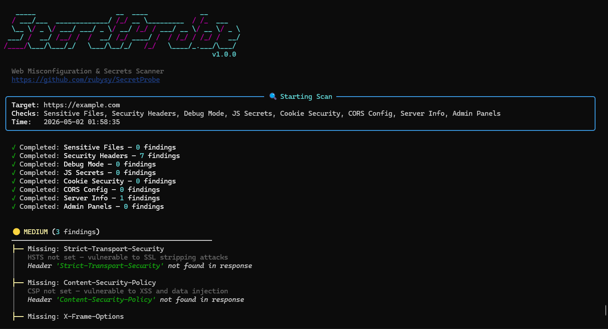
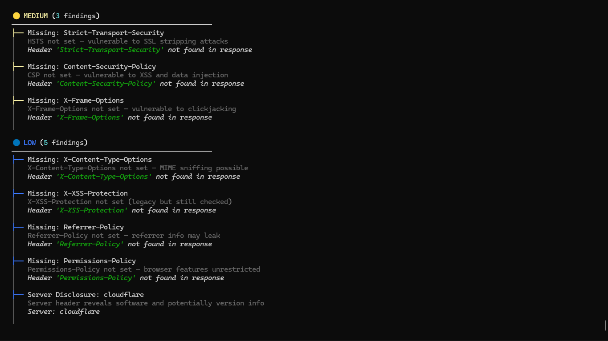

<div align="center">

```
   _____                    __  ____             __       
  / ___/___  _____________/ /_/ __ \_________  / /_  ___ 
  \__ \/ _ \/ ___/ ___/ _ \/ __/ /_/ / ___/ __ \/ __ \/ _ \
 ___/ /  __/ /__/ /  /  __/ /_/ ____/ /  / /_/ / /_/ /  __/
/____/\___/\___/_/   \___/\__/_/   /_/   \____/_.___/\___/ 
```

# SecretProbe

**Web Misconfiguration & Secrets Scanner**

[](https://python.org)
[](LICENSE)
[]()

A lightweight, modern Python tool for discovering **exposed secrets**, **misconfigurations**, and **security vulnerabilities** in web applications. Designed for bug bounty hunters, penetration testers, and security-conscious developers.

</div>

---

## What It Does?

SecretProbe automates the tedious first steps of web security assessment. Instead of manually checking for common misconfigurations one by one, run a single command and get a comprehensive security report.

```bash
python secretprobe.py -u https://target.com -o report.html
```

### Demo:





## Security Checks

| Check | Description | Detects |
|:------|:-----------|:--------|
| 🔑 **Sensitive Files** | Scans for exposed config & backup files | `.env`, `.git/`, `.sql` dumps, logs, backups |
| 🛡️ **Security Headers** | Analyzes HTTP security headers | Missing HSTS, CSP, X-Frame-Options, etc. |
| 🐛 **Debug Mode** | Detects development/debug artifacts | Laravel Debugbar, Django DEBUG=True, stack traces |
| 🔐 **JS Secrets** | Scans JavaScript for hardcoded secrets | API keys, tokens, passwords, AWS keys |
| 🍪 **Cookie Security** | Analyzes cookie security flags | Missing Secure, HttpOnly, SameSite |
| 🌐 **CORS Config** | Tests for CORS misconfigurations | Wildcard origins, origin reflection |
| 📡 **Server Info** | Checks for information disclosure | Server version, X-Powered-By, tech stack |
| 🚪 **Admin Panels** | Detects exposed admin interfaces | `/admin`, `/wp-admin`, `/phpmyadmin`, etc. |

## ⚡ Quick Start

### Installation

```bash
# Clone the repository
git clone https://github.com/rubysy/SecretProbe.git
cd SecretProbe

# Install dependencies
pip install -r requirements.txt
```

### Basic Usage

```bash
# Full scan
python secretprobe.py -u https://target.com

# Scan with HTML report
python secretprobe.py -u https://target.com -o report.html

# Run specific checks only
python secretprobe.py -u https://target.com --checks files,headers,debug

# Custom timeout
python secretprobe.py -u https://target.com --timeout 15

# Verbose mode
python secretprobe.py -u https://target.com -v
```

### Available Checks

Use `--checks` with comma-separated values:

| Flag | Check |
|:-----|:------|
| `files` | Sensitive file exposure |
| `headers` | Security headers analysis |
| `debug` | Debug mode detection |
| `secrets` | JavaScript secrets scanning |
| `cookies` | Cookie security analysis |
| `cors` | CORS misconfiguration |
| `server` | Server information disclosure |
| `admin` | Admin panel detection |
| `all` | Run all checks (default) |

## Scoring System

SecretProbe assigns a security score from **0–100** based on findings:

| Grade | Score | Meaning |
|:-----:|:-----:|:--------|
| A+ | 90-100 | Excellent security posture |
| A | 80-89 | Good, minor issues only |
| B | 70-79 | Moderate issues found |
| C | 60-69 | Significant issues present |
| D | 40-59 | Major security concerns |
| F | 0-39 | Critical vulnerabilities found |

Severity weights:
- 🔴 **CRITICAL**: -25 points (exposed secrets, source code leak)
- 🟠 **HIGH**: -15 points (debug mode, API key exposure)
- 🟡 **MEDIUM**: -8 points (missing security headers, CORS issues)
- 🔵 **LOW**: -3 points (info disclosure, minor misconfigs)

## 📄 HTML Reports

Generate beautiful, shareable HTML reports with the `-o` flag:

```bash
python secretprobe.py -u https://target.com -o report.html
```

Reports include:
- Security score and grade
- All findings with severity, evidence, and remediation
- Dark-themed responsive design
- Shareable standalone HTML file

## 🏗️ Project Structure

```
SecretProbe/
├── secretprobe.py          # CLI entry point
├── scanner/
│   ├── __init__.py         # Package metadata
│   ├── checks.py           # All security check modules
│   ├── engine.py           # Scanner orchestrator
│   ├── reporter.py         # Terminal & HTML output
│   └── utils.py            # HTTP utilities & data models
├── requirements.txt        # Python dependencies
├── LICENSE                 # MIT License
└── README.md               # This file
```

## 🤝 Contributing

Contributions are welcome! Here's how you can help:

1. **Fork** the repository
2. **Create** a feature branch (`git checkout -b feature/new-check`)
3. **Add** your security check in `scanner/checks.py`
4. **Register** it in `CHECK_REGISTRY`
5. **Submit** a pull request

### Adding a New Check

```python
# In scanner/checks.py

def check_my_new_check(target_url, session, timeout=10, verbose=False):
    """Description of what this check does."""
    findings = []
    # Your check logic here
    findings.append(Finding(
        severity=Severity.HIGH,
        title="Issue Found",
        description="Detailed description",
        evidence="Evidence details",
        remediation="How to fix",
        url=target_url,
        category="Category Name"
    ))
    return findings

# Register in CHECK_REGISTRY
CHECK_REGISTRY["mycheck"] = ("My New Check", check_my_new_check)
```

## ⚠️ Disclaimer

This tool is intended for **authorized security testing only**. Only scan targets you have explicit permission to test. The authors are not responsible for any misuse of this tool.

**Always obtain proper authorization before scanning any web application.**

## 📜 License

This project is licensed under the MIT License — see the [LICENSE](LICENSE) file for details.

---

<div align="center">

**Made by rubysy**

⭐Star this repo if you find it useful!
thanks.

</div>
